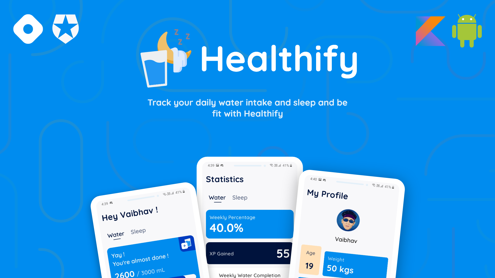

# **Healthify** 

**Healthify** is an app to track your daily water intake and sleep and boost your work efficiency.

# Video Introduction 📹

This is a small introduction video about healthify https://youtu.be/QiP8NkIqVQs.

# Blog ✍

To know more about how I build this project, read my article on https://vaibhav2002.hashnode.dev/healthify-an-app-to-track-your-daily-water-intake-and-sleep-and-boost-your-work-efficiency-auth0hackathon

# Application Install

***You can Install and test latest Healthify app from below 👇***

[](https://github.com/Vaibhav2002/Healthify/releases/tag/v1.0.0)

## Setup
- Clone the repository on your machine.
- Create project in Firebase, enable firestore, set rules to public and download google-services.json and paste in the app folder.
- Sign up for auth0 and do as stated below

Open strings.xml and add Auth0 credentials 

```xml

    <!--    add your Auth0 scheme here-->
    <string name="scheme"></string>

    <!--    add your Auth0 domain name here-->
    <string name="domain"></string>

    <!--    add your Auth0 client id here-->
    <string name="client"></string>

```

Open Secrets.kt in util package and add your Auth0 credentials

```kotlin

   const val CLIENT_ID = ""            // add you Auth0 client id here
   const val DOMAIN_NAME = ""          // add you Auth0 domain name here

```

## About

 It uses Firebase and Auth0 as its backend. It uses Auth0 for email based auth and Google auth and Firebase Firestore as its database.

- Fully functionable. 
- Clean and Simple Material UI.
- It supports dark theme too 🌗.

### App Features

- **User Authentication** - Allowing users to login and register using auth0.
- **Dashboard** - There are two dashboards for sleep and water. It shows the amount of water drank and hours slept and also logs for each.
- **Add Water** - Selecting water amount to add in daily water list.
- **Water Drinking Notification** - Healthify reminds you to drink water by sending a notification after 1 hour of your last tracked water intake.
- **Add Sleep** - Selecting number of hours to add in daily sleep list
- **Statistics** - Shows statistics of water drank and hours slept within last week. 
- **Profile** - Shows user's profile.
- **Leaderboard** - Shows a leaderboard consisting of all users ranked based on XP points.
- **About** - Shows information about the app like its version number and more.

### Insights into the app 🔎


**Healthify** offers light as well as dark theme 🌓. So now you can use Healthify in whatever theme you like the most. 🔥


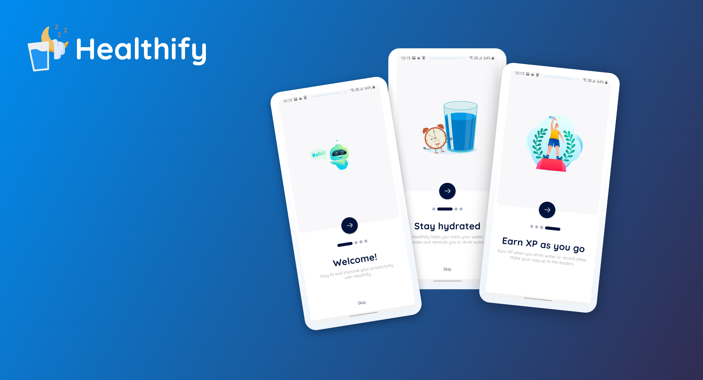


**Healthify** has a clean and sleek user interface which makes it easy for people of all age groups use it. 😁


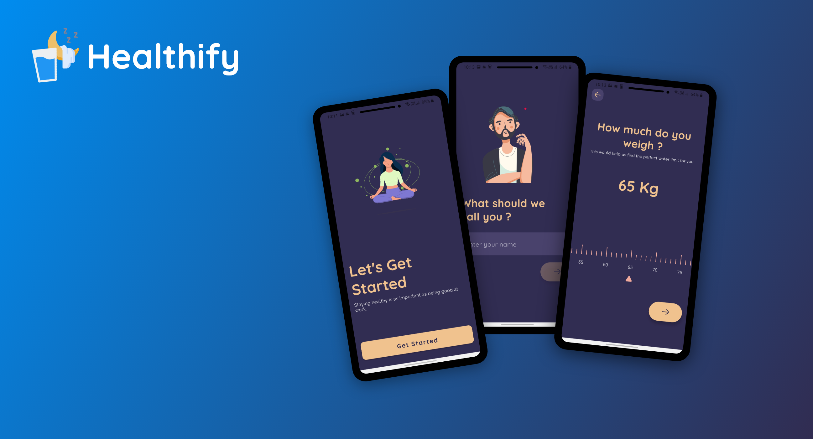


**Healthify** uses Auth0 for authentication. It supports email-based authentication as well as Google authentication. **Healthify** also has a smooth user onboarding process.


Have a look at your daily water intake and statistics of your water intake in the last week.


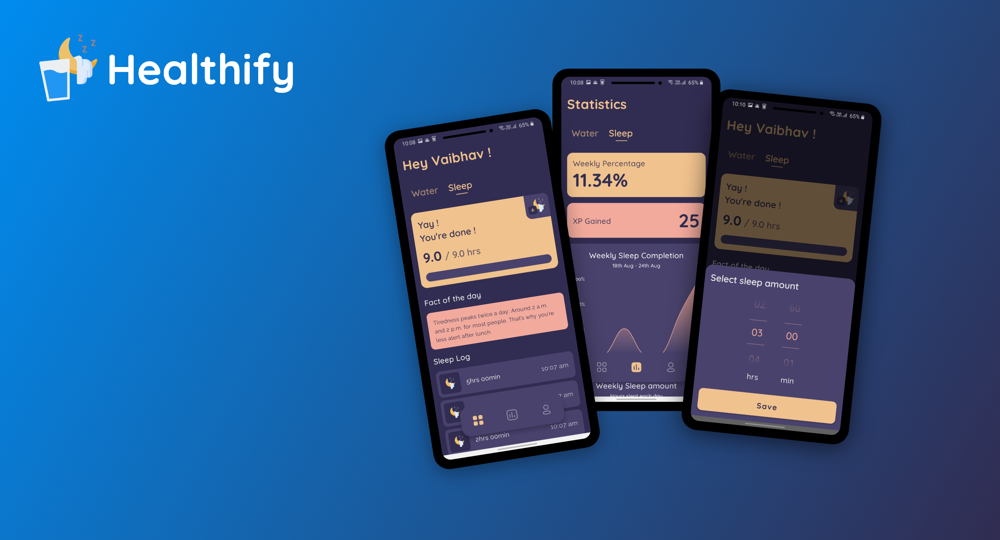

Have a look at your daily sleep 😴 amount and statistics of your sleep in the last week.


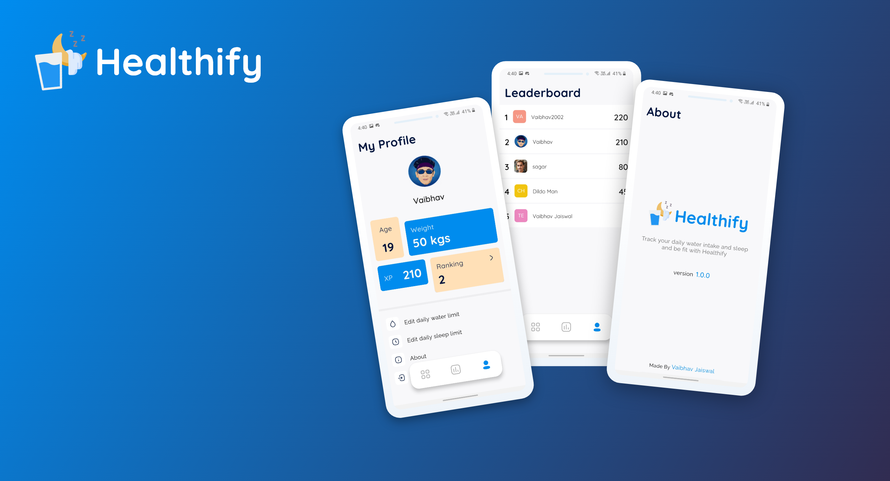

**Healthify** has a XP based ranking system which ranks you among other users. XP can be gained by adding water and sleep. Having such ranking system in this app will make users compete and hence make it a habit of users to drink water and get enough sleep

## 📸 Screenshots

|||||
|:----------------------------------------:|:-----------------------------------------:|:-----------------------------------------: |:-----------------------------------------: |
| 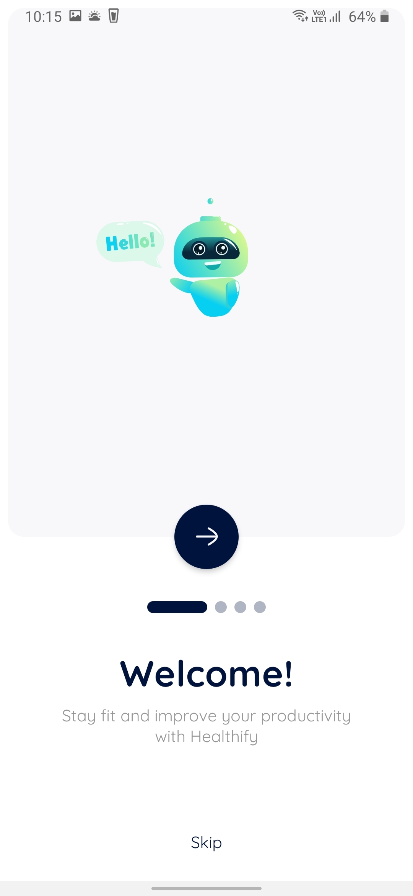 | 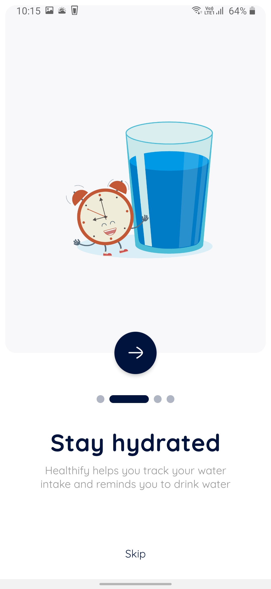 |  | 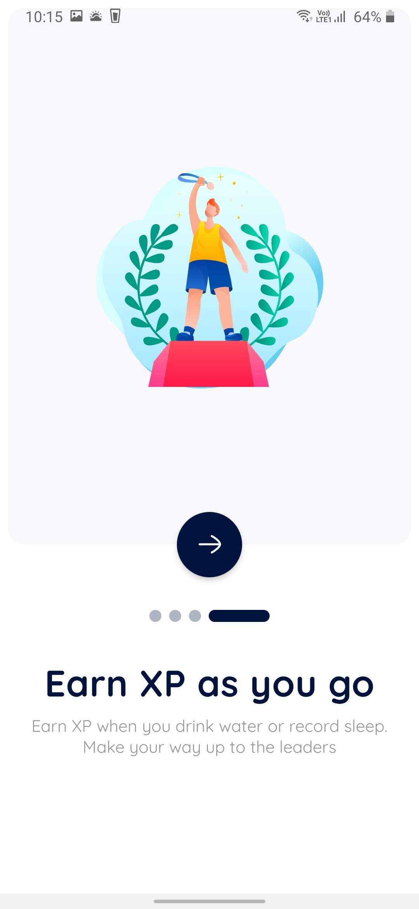 |
| 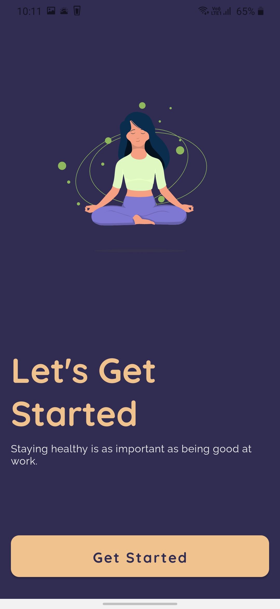  | 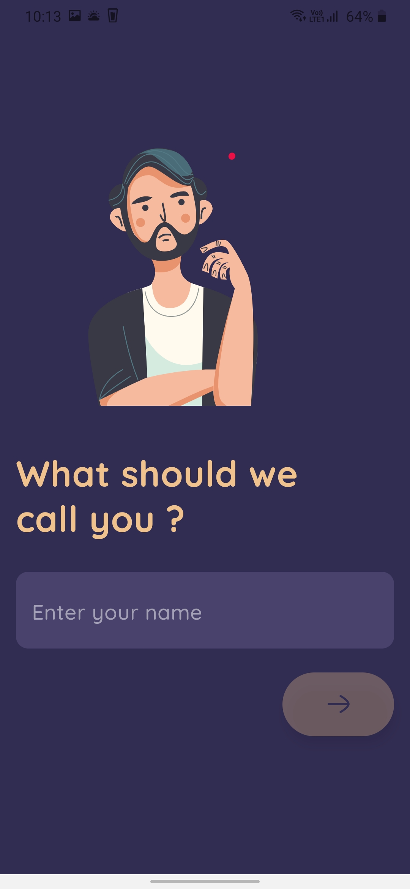 | 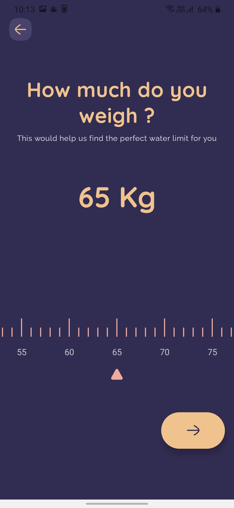    | 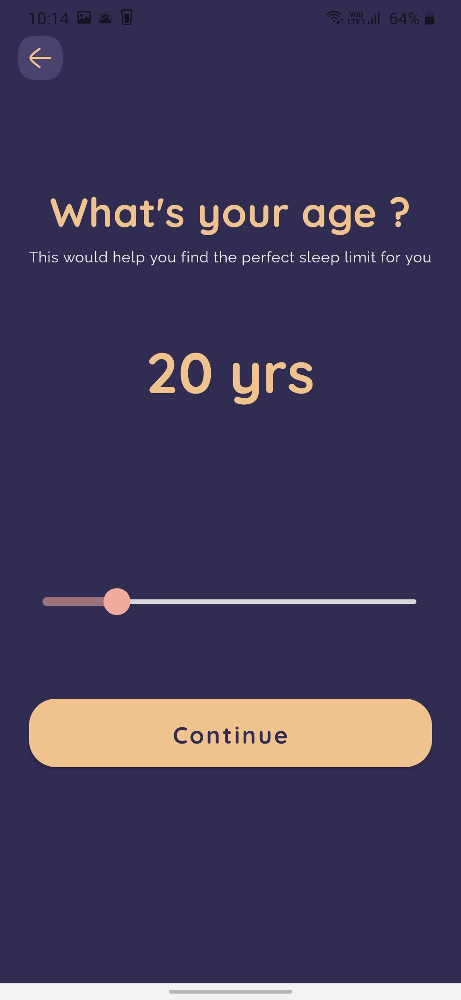 |
| 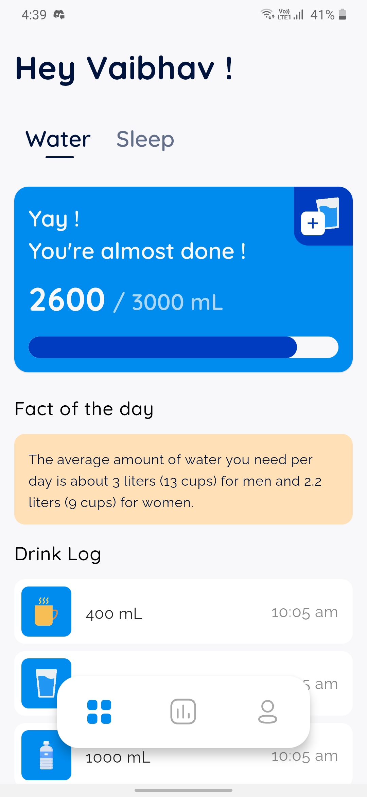 |     | 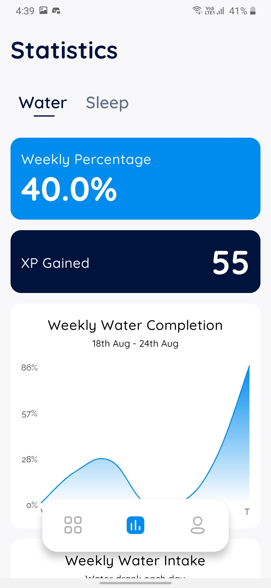      | 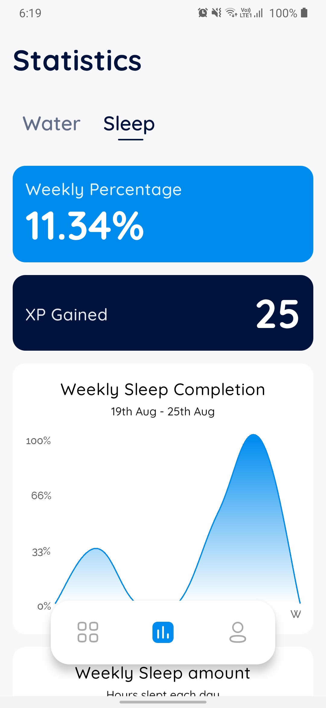 |
| 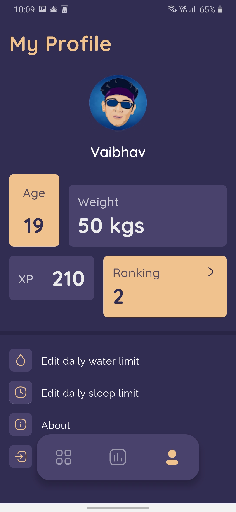  |    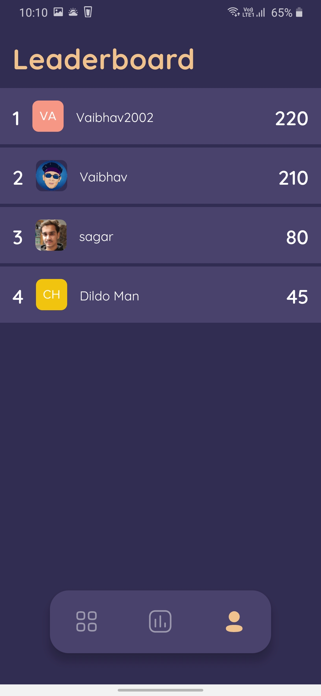    | 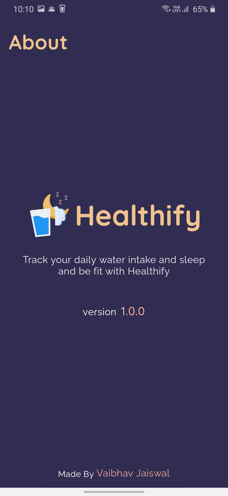        |  |


### Technical details 

- Healthify uses Auth0 for user authentication, it supports email based authentication and Google authentication
- Healthify uses Firebase Firestore as it's primary database.
- Healthify has full offline support, it uses Android's ROOM database for caching all data offline.
- Healthify is made using Kotlin and following Modern Android Development practices.
- Healthify uses all Jetpack libraries and follows MVVM architecture. It also has a G.O.A.T rating in Android's  M.A.D scorecard.
- Healthify's code follows all the best practices and software development principles which make it a very good learning resource for beginners.


## Built With 🛠
- [Kotlin](https://kotlinlang.org/) - First class and official programming language for Android development.
- [Coroutines](https://kotlinlang.org/docs/reference/coroutines-overview.html) - For asynchronous and more..
- [Flow](https://kotlin.github.io/kotlinx.coroutines/kotlinx-coroutines-core/kotlinx.coroutines.flow/-flow/) - A cold asynchronous data stream that sequentially emits values and completes normally or with an exception.
 - [StateFlow](https://developer.android.com/kotlin/flow/stateflow-and-sharedflow) - StateFlow is a state-holder observable flow that emits the current and new state updates to its collectors.
 - [SharedFlow](https://developer.android.com/kotlin/flow/stateflow-and-sharedflow) - A SharedFlow is a highly-configurable generalization of StateFlow.
- [Android Architecture Components](https://developer.android.com/topic/libraries/architecture) - Collection of libraries that help you design robust, testable, and maintainable apps.
  - [ViewModel](https://developer.android.com/topic/libraries/architecture/viewmodel) - Stores UI-related data that isn't destroyed on UI changes. 
  - [ViewBinding](https://developer.android.com/topic/libraries/view-binding) - Generates a binding class for each XML layout file present in that module and allows you to more easily write code that interacts with views.
  - [DataBinding](https://developer.android.com/topic/libraries/data-binding) - Binds data directly into XML layouts
  - [Room](https://developer.android.com/training/data-storage/room) - Room is an android library which is an ORM which wraps android's native SQLite database
  - [DataStore](https://developer.android.com/topic/libraries/architecture/datastore) - Jetpack DataStore is a data storage solution that allows you to store key-value pairs or typed objects with protocol buffers.
- [Dependency Injection](https://developer.android.com/training/dependency-injection) - 
  - [Hilt-Dagger](https://dagger.dev/hilt/) - Standard library to incorporate Dagger dependency injection into an Android application.
  - [Hilt-ViewModel](https://developer.android.com/training/dependency-injection/hilt-jetpack) - DI for injecting `ViewModel`.
- Backend
  - [Firebase](https://firebase.google.com)
    - Firebase Firestore - A NoSQL database to store all data
  - [Auth0](https://auth0.com) -  Auth0 is an easy to implement, adaptable authentication and authorization platform.
- [GSON](https://github.com/google/gson) - A modern JSON library for Kotlin and Java.
- [Timber](https://github.com/JakeWharton/timber) - A simple logging library for android.
- [GSON Converter](https://github.com/square/retrofit/tree/master/retrofit-converters/gson) - A Converter which uses Moshi for serialization to and from JSON.
- [Coil](https://github.com/coil-kt/coil) - An image loading library for Android backed by Kotlin Coroutines.
- [Material Components for Android](https://github.com/material-components/material-components-android) - Modular and customizable Material Design UI components for Android.

# Package Structure
    
    com.vaibhav.healthify    # Root Package
    .
    ├── data                # For data handling.
    |   ├── local           # Room DB and its related classes
    |   ├── remote          # Firebase, Auth0 and their relative classes
    │   ├── model           # Model data classes and mapper classes, both remote and local entities
    │   └── repo            # Single source of data.
    |
    ├── di                  # Dependency Injection             
    │   └── module          # DI Modules
    |
    ├── ui                  # UI/View layer
    |   ├── adapters        # All Adapters, viewholder and diffUtils for recyclerViews   
    |   ├── dialog          # All Dialog Fragments and their viewmodels      
    │   ├── auth            # Authorization Activity and its fragments
    │   ├── homeScreen      # Home Activity and its fragments
    |   ├── userDetails     # User Details Activity and its fragments
    |   ├── onBoarding      # OnboardingScreen
    │   └── splashScreen    # SplashScreen
    |
    └── utils               # Utility Classes / Kotlin extensions


## Architecture
This app uses [***MVVM (Model View View-Model)***](https://developer.android.com/jetpack/docs/guide#recommended-app-arch) architecture.


  


---

## If you like my projects and want to support me to build more cool open source projects
  
<a href="https://www.buymeacoffee.com/VaibhavJaiswal"></a>

---

 ## Contact
If you need any help, you can connect with me.

Visit:- [Vaibhav Jaiswal](https://vaibhavjaiswal.vercel.app/#/)
  


